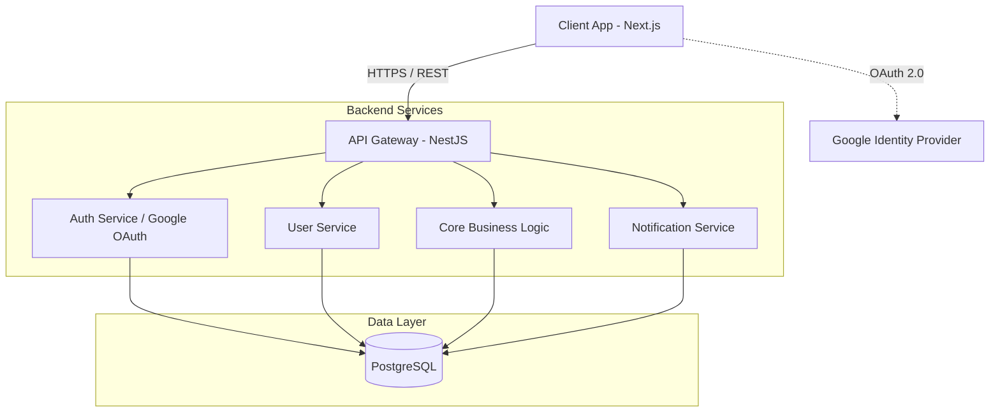

# Architecture

## System Architecture Diagram

## API Flow
1. **Request Initiation:** Client sends an HTTP request with a JWT Bearer token in the header.
2. **Gateway / Controller:** The NestJS API controller receives the request, applying global CORS policies and rate limiting.
3. **Middleware / Guards:** The AuthGuard intercepts the request to validate the JWT. If invalid, returns a `401 Unauthorized`.
4. **Service Layer:** The controller delegates the request to the appropriate Domain Service (e.g., `UserService`).
5. **Business Logic & Validation:** The service processes the request, applying business rules.
6. **Data Access Layer:** The service interacts with PostgreSQL via Prisma ORM to fetch or mutate data securely.
7. **Response:** Data is formatted using Data Transfer Objects (DTOs) and returned to the client.

## Component Interaction
- **Frontend State:** Managed globally using Zustand, and server state via React Query (or Next.js native fetching).
- **UI Layout (Bento Grid):** Components are independent, self-contained widgets. They fetch their own data asynchronously using React Suspense boundaries, displaying skeleton loaders during the fetching phase to ensure a Fast UX.
